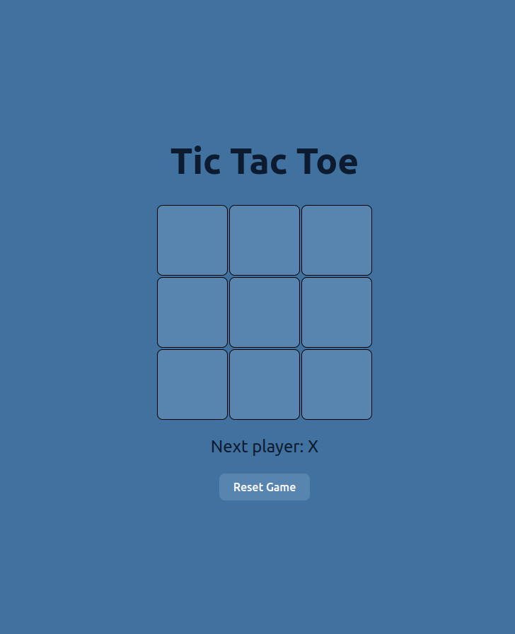

# Tic Tac Toe Game

**Welcome to the Tic Tac Toe Game!** This project is a modern twist on the classic Tic Tac Toe game, developed using React. It's designed for both fun and learning, perfect for players of all ages!

### 🕹️ Get Started
Jump right into the action! Click the button below to start your Tic Tac Toe adventure.

[](https://tic-tac-toe-game-mzvf.onrender.com)

### 🌟 Features
- **Intuitive Gameplay**: Simple rules make it easy to pick up and play.
- **Dynamic UI**: The game adjusts to different screen sizes, ensuring a great experience on any device.
- **Victory Highlights**: Winning moves are clearly highlighted, enhancing gameplay enjoyment.
- **Reset Functionality**: Easily reset the game to start fresh.

### 🛠️ Tech Stack
- **React**: For building a responsive and interactive UI.
- **JavaScript (ES6+)**: Utilizing modern JavaScript features for cleaner code.
- **CSS**: Custom styling to bring the game to life.
- **Vercel**: Deployed effortlessly on Vercel for fast and reliable access.

### 🚀 How to Run Locally
To set up the project on your machine, follow these steps:

1. Clone the repository:
   ```bash
   git clone git@github.com:UroojSharif/Tic-Tac-Toe-Game.git
   
2. Navigate into the directory:
   ```bash
   cd tic-tac-toe-react


3. Install the dependencies:
   ```bash
   npm install

4. Start the development server:
   ```bash
   npm run dev
You can now play the game locally in your web browser!

### 💡 Enjoy the Game!
Dive into the nostalgic world of Tic Tac Toe and challenge your friends or family. Have fun!
